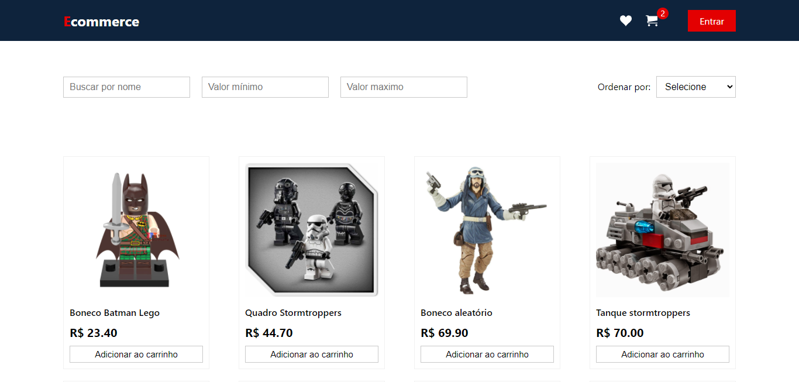
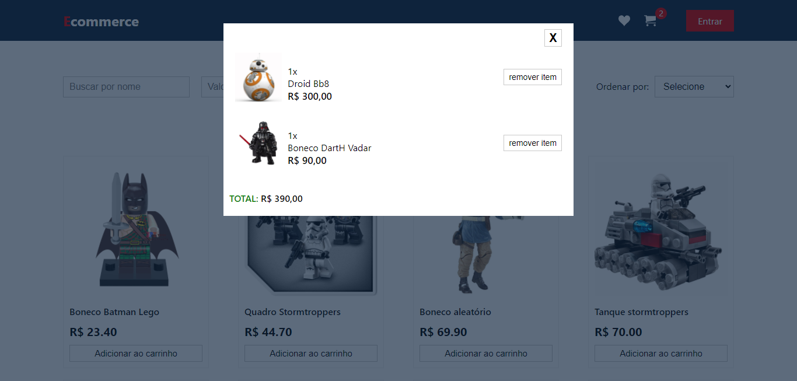

# Projeto LabECommerce

Projeto desenvolvido para prática de busca, ordenação e filtros utilizando React.

## Link do Surge

## O que funciona

- Adiconar produtos no carrinho
- Remover produtos do carrinho
- Salvar produtos do carrinho no localStorage do navegador
- Filtragem de produtos por nome, valor mínimo e valor máximo
- Ordenação por order crescente e decrescente
- Responsividade

## O que não funciona

- Botão de login
- Botaõ de favoritos

## Integrantes

- Flávio José Fonseca Filho
- Laís de Medeiros Silva
- Luiz Gustavo Santos
